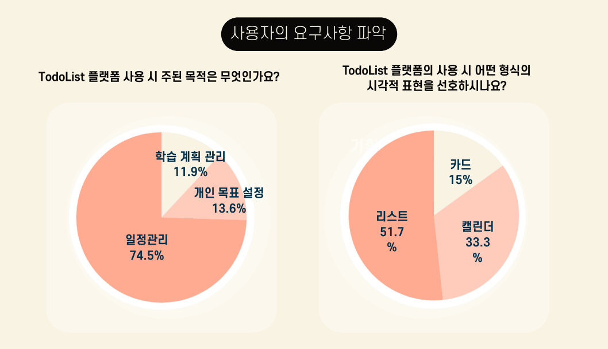

# 🌰 Do-Tori 🌰

## 프로젝트 개요

### 주제 및 선정 배경

Do-Tori는 사용자들이 자신의 할 일 목록을 공유하고, 질문과 답변을 주고받을 수 있는 커뮤니티 앱입니다. 이 앱을 통해 사용자는 자신의 할 일을 효율적으로 관리하고, 다른 사용자들과 소통하며 도움을 받을 수 있는 편리한 환경을 제공받게 됩니다. 

**기획의도**: 사용자가 자신의 할 일을 공유하며 함께한다는 가치에서 오는 생산성 향상에 기반하여, todo와 community 기능을 결합하게 되었습니다. 커뮤니티에서 소외감을 느끼지 않도록 AI 답변 기능을 추가하여 질문에 대한 즉각적인 답변을 받을 수 있게 했습니다.

### 🔎 Team Member

| 김신이(PL) | 이소현 | 조민준 | 채현영 |
| --- | --- | --- | --- |
|  |  |  |  |
| [@SiNiKin](https://github.com/SiNiKin) | [@LeeSoHyunn](https://github.com/LeeSoHyunn) | [@Rencal3491](https://github.com/Rencal3491) | [@CheHyeonYeong](https://github.com/CheHyeonYeong)  |

### 프로젝트 개요

블로그 및 게시판 형식을 활용한 커뮤니티 사이트 개발

**앱 이름**: Do-Tori 🌰

#### 기능 소개

1. **Todo-Tori (메인 기능)**
    - 할 일 목록 관리 페이지 제공
    - 날짜별 할 일 목록 확인 가능
    - 할 일 추가, 삭제, 수정 기능 제공
    - 해빗트레커 기능을 통한 할 일 달성도 확인
    - NavBar를 통해 쉽게 이동 가능

2. **My Page**
    - 로그인, 로그아웃 기능 제공
    - 회원 탈퇴 및 회원 정보 수정 가능

3. **커뮤니티**
    - 하루 목록을 공유할 수 있는 게시판
    - 게시물 수정, 삭제, 등록 가능
    - 댓글 기능을 통한 질문과 답변(Q&A) 기능 제공
    - 특정 시간 이상 경과 시 AI가 일괄 답변 가능
    - 연속적으로 더보기 형식으로 게시글 표시
    - 게시글 내용, 제목, 작성자, 태그 등으로 검색 가능
    - 게시글에 사진 업로드 가능

4. **튜토리얼**
    - 앱 사용 방법을 안내하는 이미지 기반 튜토리얼 제공

### 활용 장비 및 재료

- PostMan
- IntelliJ
- Java 17 SDK
- GitHub
- Notion
- KakaoTalk
- Spring Boot

### 프로젝트 구조

#### ERD 및 아키텍처

### 기대 효과

1. **할 일 관리의 효율성 증대**:
    - 사용자는 Do-Tori를 통해 할 일을 관리하고, 날짜별로 정리하여 시각화할 수 있습니다.
    - 이를 통해 일정을 보다 체계적으로 관리할 수 있습니다.

2. **사용자 간의 상호작용 강화**:
    - 커뮤니티 기능을 통해 사용자들은 자신의 경험을 공유하고, 질문과 답변을 주고받을 수 있습니다.
    - 이를 통해 다양한 의견과 지식을 공유하며 서로 도움을 주고받을 수 있습니다.

3. **사용자 참여도 증대**:
    - 사용자들은 자신의 경험을 공유하고, 다른 사용자들의 게시물에 댓글을 남기는 등의 활동을 통해 커뮤니티에 적극적으로 참여할 수 있습니다.
    - 이는 사용자들 간의 유대감을 형성하고, 앱의 활성화를 촉진할 것입니다.

4. **지속적인 성장과 발전**:
    - 사용자들로부터 피드백을 받고, 개선점을 파악하여 지속적으로 서비스를 개선해 나갈 수 있습니다.
    - 이를 통해 앱은 지속적으로 발전하며, 사용자들에게 더 나은 경험을 제공할 수 있을 것입니다.
  

# 프로젝트 수행결과

